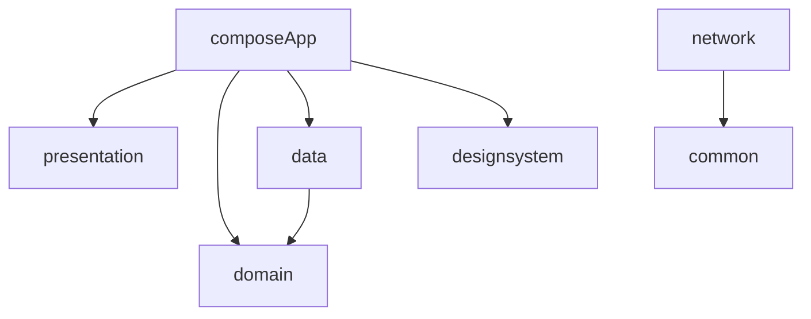

# Alice 🐺

A Kotlin Multiplatform Mobile (KMM) application for browsing car brands and models.

## 📱 Screenshots

*Run the app on an emulator to see the new UI!*

## 🏗️ Architecture

The project follows **Clean Architecture** with the following modules:

```
Alice/
├── composeApp/          # App entry point, screens, navigation
├── presentation/        # BaseViewModel, MVI interfaces (UiState, UiIntent, UiEffect)
├── domain/              # Pure Kotlin entities & repository interfaces
├── data/                # Repository implementations, fake data
├── designsystem/        # UI components, theme, colors
├── network/             # Ktor client, API services
└── common/              # Shared utilities (Result, ErrorState)
```

### Module Dependencies



## 🎨 Design System

### Colors (Alice Branding)
| Name | Hex | Usage |
|------|-----|-------|
| Primary (Copper) | `#C4956A` | Buttons, accents |
| Secondary (Dark Brown) | `#4A3C31` | Text, icons |
| Light Tan | `#D4A574` | Secondary accents |
| Background | `#FAFAFA` | Screen background |

### Components
- `AHeader` - App header with logo and action icons
- `ASearchField` - Search input with clear button
- `AGridCard` - Image + title card for grid displays
- `ABottomNavBar` - Bottom navigation with 4 tabs
- `APrimaryButton`, `AOutlinedButton`, `ATextButton` - Button variants
- `ACard`, `ATextField` - Common UI elements

## 🔧 Tech Stack

- **Kotlin Multiplatform** - Shared code for Android & iOS
- **Compose Multiplatform** - Declarative UI
- **Koin** - Dependency Injection
- **Coil 3** - Image loading
- **Ktor** - Networking (prepared for future API)
- **Navigation Compose** - Type-safe navigation

## 🚀 Getting Started

### Prerequisites
- Android Studio Ladybug or later
- Xcode 15+ (for iOS)
- JDK 11+

### Build & Run

```bash
# Android
./gradlew :composeApp:assembleDebug

# iOS (via Xcode)
open iosApp/iosApp.xcodeproj
```

### Running Tests

```bash
./gradlew test
```

## 📁 Project Structure

### Screens
- **BrandsScreen** - 2-column grid of car brands
- **ModelsScreen** - List of car models for selected brand

### ViewModels (MVI Pattern)
```kotlin
class BrandsViewModel(
    private val brandRepository: BrandRepository
) : BaseViewModel<BrandsState, BrandsIntent, BrandsEffect>(BrandsState()) {
    override fun handleIntent(intent: BrandsIntent) { ... }
}
```

### Navigation
Type-safe navigation using Kotlin serialization:
```kotlin
@Serializable data object Brands : Routes
@Serializable data class Models(val brandId: String, val brandName: String) : Routes
```

## 📝 License

MIT License - see [LICENSE](LICENSE) for details.

---

Built with ❤️ using Kotlin Multiplatform