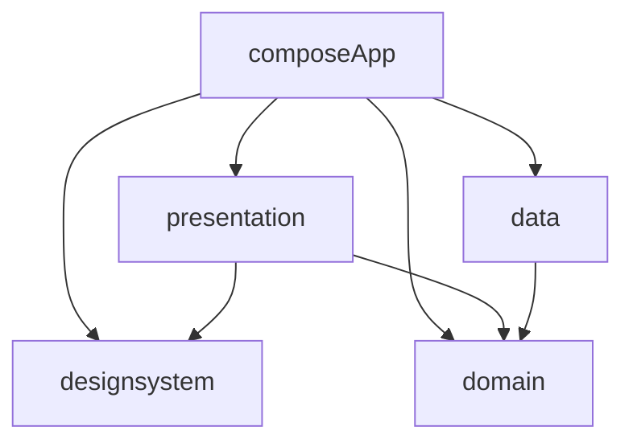

# Alice 🐺

A Kotlin Multiplatform Mobile (KMM) application for browsing car brands, models, and discovering car-related services and places.

## 📱 Screenshots

*Run the app on an emulator to see the new UI!*

## 🏗️ Architecture

The project follows **Clean Architecture** with the following modules:

```
Alice/
├── composeApp/          # App entry point, navigation, DI initialization
├── presentation/        # Screens, ViewModels (MVI), UI contracts
├── domain/              # Pure Kotlin entities & repository interfaces
├── data/                # Repository implementations, fake data sources
└── designsystem/        # Reusable UI components, theme, colors, typography
```

### Module Dependencies


```mermaid
graph TD
    composeApp --> presentation
    composeApp --> domain
    composeApp --> data
    composeApp --> designsystem
    presentation --> designsystem
    presentation --> domain
    data --> domain
```

## 🎨 Design System

### Colors (Alice Branding)
| Name | Hex | Usage |
|------|-----|-------|
| Primary (Copper) | `#C4956A` | Buttons, accents, active tabs |
| Secondary (Dark Brown) | `#4A3C31` | Text, icons |
| Light Tan | `#D4A574` | Secondary accents |
| Background | `#FAFAFA` | Screen background |
| Surface Variant | `#F5F0EB` | Card backgrounds, tab backgrounds |

### Components
- `AHeader` - App header with logo and action icons
- `ASearchField` - Search input with clear button
- `AGridCard` - Image + title card for grid displays
- `APlaceCard` - Place card with image, title, address, details & save buttons
- `ATabRow` - Animated pill-shaped tab row
- `ASelector` - Pill-shaped dropdown selector (location, category)
- `ABottomNavBar` - Bottom navigation with 4 tabs
- `APrimaryButton`, `AOutlinedButton`, `ATextButton` - Button variants
- `ACard`, `ATextField` - Common UI elements
- `ADrawer` - Navigation drawer with menu items
- `AShimmer` - Loading skeleton animation

## 🔧 Tech Stack

- **Kotlin Multiplatform** - Shared code for Android & iOS
- **Compose Multiplatform** - Declarative UI
- **Koin** - Dependency Injection
- **Coil 3** - Image loading
- **Ktor** - Networking (prepared for future API)
- **Navigation Compose** - Type-safe navigation
- **Kotlin Serialization** - Route serialization

## 🚀 Getting Started

### Prerequisites
- Android Studio Ladybug or later
- Xcode 15+ (for iOS)
- JDK 11+

### Build & Run

```bash
# Android
./gradlew :composeApp:assembleDebug

# iOS (via Xcode)
open iosApp/iosApp.xcodeproj
```

### Running Tests

```bash
./gradlew test
```

## 📁 Project Structure

### Domain Entities
- `Brand` - Car brand/manufacturer (id, name, logoUrl, country, etc.)
- `CarModel` - Car model (id, name, price, specs, images, etc.)
- `Place` - Service provider/place (id, name, address, categoryId, imageUrl, isSaved)
- `ServiceCategory` - Service category with tab assignment (id, name, tab)
- `ServiceTab` - Enum: `TAB_ONE`, `TAB_TWO`

### Screens
- **BrandsScreen** - 2-column grid of car brands with search
- **ModelsScreen** - List of car models for selected brand
- **CarDetailsScreen** - Detailed view of a car model
- **PlacesScreen** - Service providers organized by category tabs
  - Location selector (city picker)
  - Search functionality
  - Two category tabs (القائمة الأولى / القائمة الثانية)
  - Service category dropdown
  - Scrollable place cards

### ViewModels (MVI Pattern)
```kotlin
// All ViewModels follow this pattern:
class BrandsViewModel(
    private val brandRepository: BrandRepository
) : BaseViewModel<BrandsState, BrandsIntent, BrandsEffect>(BrandsState()) {
    override fun handleIntent(intent: BrandsIntent) { ... }
}
```

### Navigation
Type-safe navigation using Kotlin serialization:
```kotlin
@Serializable data object Brands
@Serializable data class Models(val brandId: String, val brandName: String)
@Serializable data class CarDetails(val modelId: String, val modelName: String)
@Serializable data object Places
```

### Service Categories (37 total)
**Tab 1 — Sales, Maintenance, Oils & Tires:**
- Car showrooms (new/used), installment sales, import/export, auctions
- Maintenance centers, mechanic/electrical/AC workshops, body & paint, diagnostics, transmission
- Oil change, tire fitting, wheel alignment, batteries

**Tab 2 — Washing, Accessories, Services, Electric:**
- Car wash (manual/automatic), polishing, nano ceramic, PPF, interior cleaning
- Spare parts, accessories, audio systems, glass, GPS/alarm
- Car rental, towing, roadside assistance, pre-purchase inspection, customization
- Electric vehicle maintenance, charging stations, smart car programming

## 📝 License

MIT License - see [LICENSE](LICENSE) for details.

---

Built with ❤️ using Kotlin Multiplatform